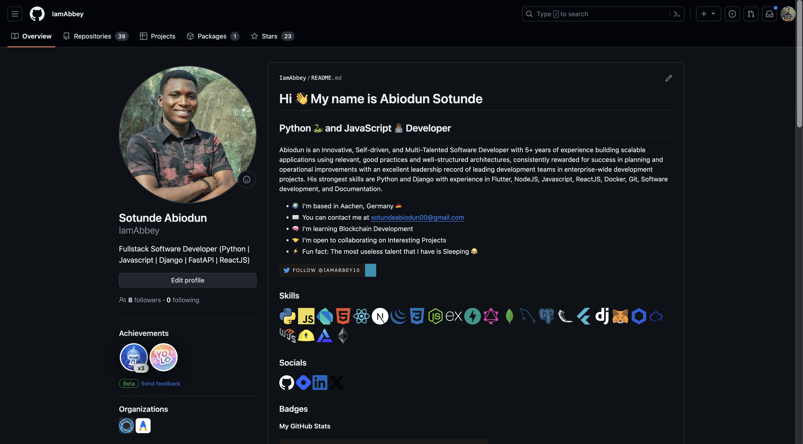

[Profileme.dev](profileme.dev) is an online easy-to-use platform that helps developers create an awesome GitHub profile in minutes.

It allows you to generate a beautiful landing page for your GitHub profile.

#### STEPS
1. Visit profileme.dev, create your own beautiful profile, and Click the COPY button to copy your code.

2. Log in to GitHub.

3. Click on the + icon on the top right of the page and select New Repository.

4. Create a new repository using your GitHub username as the repository name.

5. Check the add a README file checkbox and also make the repository a public repo.

6. Click the Create repository button.

7. Click the pencil icon on [YourName]/README.md to edit the README.md file.

8. Paste your code from profileme.dev into the 'Edit file' text editor.

9. Click the Preview tab to preview your new profile.

10. Click Commit Changes to save your new GitHub profile.

