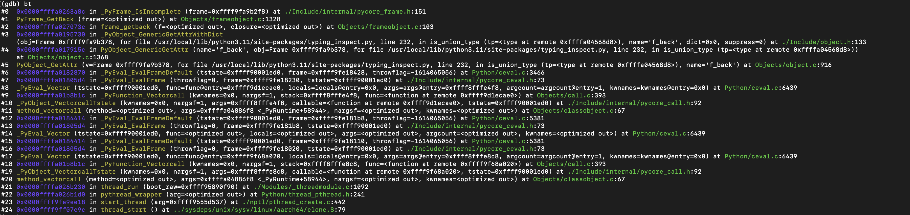
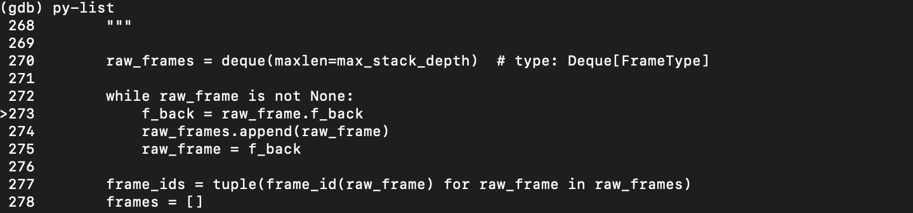

Sometimes ago, we noticed sudden restarts of the one of our web servers and from the logs we found out that this sudden restarts/crash was caused by a segmentation fault error `SIGSEGV`. 

This restarts/error happens sparingly and also in the logs there are no useful information or stack trace as to what causes the issue. After which the web server crashes and restarts.

Extract from log: `Worker (pid:33) was sent SIGSEGV!` 

As seen from the above log extract, this information is not too very useful but one very interesting part of the log is `SIGSEGV`.

### What is Segmentation fault error (`SIGSEGV`)?
Segmentation faults in C or C++ is an error that occurs when a program attempts to access a memory location it does not have permission to access.

A segmentation fault (aka `segfault`) is a common condition that causes programs to crash. Segfaults are caused by **a program trying to read or write an illegal memory location**.

From the above definition, we know that a particular program tried to read/write an illegal memory location.

#### Now comes the question, which program 🤔?

To answer this question, we need to analyse the core dump - core dump analysis is one approach for debugging.

> A core dump is a copy of process memory – the name coming from the era of magnetic core memory.

> A core dump can be analyzed using a debugger.

#### Getting the core dumps.

- _Little Back Story_ :
At the time of writing this, our services runs on `Heroku`. The ~~great~~ Heroku, which greatly restricts access to the unlying host in which the services are running.

This is a problem because as such we cannot configure the maximum size of the core dumps created, which by default is 0. You can run `ulimit -c` to view the max size configuration

Secondly, we cannot access the file system or even get to override the path where the core dumps are stored, which defaults to `core`. You can run `/proc/sys/kernel/core_pattern` to view the core dump path.

Summary?, With Heroku!, there is no way to access, or at large analyse core dumps.

Which led to setting up a running `dockerized` prototype of our application on ECS utilising AWS Fargate.

> [!Side Information]
> There are some things to note about accessing core dumps in a dockerized service.
> 1. Core dump limit can be configured with the --ulimit docker option [compose file](https://docs.docker.com/compose/compose-file/compose-file-v3/#ulimits) | [build command](https://docs.docker.com/engine/reference/commandline/build/#ulimit). For our prototype we set this to `unlimited`.
> ``` 
> 
> 	With Compose file container config
> 		ulimits:  
> 			core:  
> 			soft: -1  
> 			hard: -1
> 
> 
> 	With Run command option
> 		--ulimit core=-1:-1
> ```
> 
> 2. Path in `/proc/sys/kernel/core_pattern` for a docker container is the same as the unlying host it is running on.
> 
> When a segmentation fault happens; with `ulimit -c` set to zero; core dumps is disabled for the process and its children; You see the below log
> `Segmentation fault`
> 
> When a segmentation fault happens; with `ulimit -c` set to `ulimited` or high number; core dumps is enabled for the process and its children; You see the below log
> `Segmentation fault (core dumped)`


Now, having gotten the right configuration on the prototype, I was able to reproduce the exception and got the Segmentation fault error, we now have a core dump file to analyse 💆‍♂️.

#### Analysing core dumps 🕵️‍♂️.

The core dump was 'dumped' in the current working directory as in `/proc/sys/kernel/core_pattern`

- To analyse the core dumps, within the running container, I ran `gdb` (install with `apt-get install gdb` if it does not exist) with the target program (in our case `Python`) and the core dump file:
	
	The marked area is interesting as it shows that it is a segmentation fault in one of the `CPython` file.

- Futhermore, I ran the `bt` command to show the Stack back traces on how we arrived at the point of failure, these are often enough to help identify a common problem. It's usually the first command one would use in a gdb session: `bt` (short for backtrace)
	
	*We can also use the `bt full` - this shows the Stack back traces and Print the values of the local variables also. This was useful as it gave insights as to what might be associated with cause of the issue.*

**Now with the GDB Python Support [info](https://devguide.python.org/development-tools/gdb/); we can further enhance gdb for easier debugging of a CPython process.**

- Using the `py-bt` command, I can now see a Python-level backtrace of the current thread; and this indeed was helpful as I was now able to see indeed the affected package, affected python level file and code line.
	

- Using the `py-list` command, you can see the faulty code fragement; and also th `>` point to the fault line.


#### Final Words

After the investigation and analyses, I was able to detect the issue was caused in the `sentry_sdk` and it is related to `CPython`.
With this knowledge I proceeded to report the issue on sentry github [Issue Link](https://github.com/getsentry/sentry-python/issues/2386), and a formal investigation commenced on it.

Indeed this kind of issue or error is not **the usual Python bug 🐞**


Thanks for reading ✨


#### Useful links

- https://www.brendangregg.com/blog/2016-08-09/gdb-example-ncurses.html
- https://tutorialadda.com/gdb/what-is-core-dump-and-how-to-analyse-core-dump-using-gdb
- https://sourceware.org/gdb/onlinedocs/gdb/